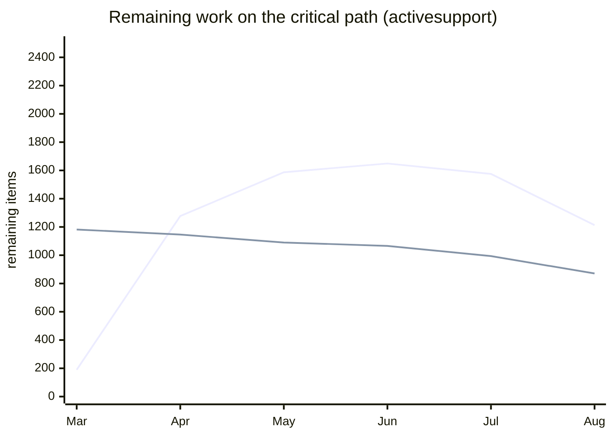
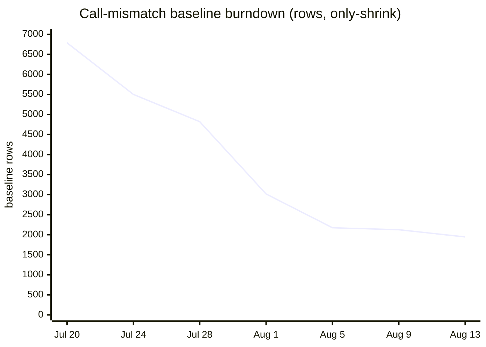

# Parity convergence audit & forecast — ActiveRecord + dependencies

Status: analysis (no code changes; findings only). Data through 2026-08-12
(3,669 merged-PR snapshots in `stats.db`, 2026-03-12 → 2026-08-12). All
queries below run against `stats.db` read-only; registry history is
reconstructed from `origin/main` git history.

**Scope** — `activerecord` plus its manifest-verified dependency closure:
`activesupport`, `activemodel`, `arel`, `date`, `did-you-mean`, `globalid`,
`i18n`. (`rack` is _not_ in the closure — no manifest in the chain depends on
it.) All five gates: test parity, api parity (public + privates), call-set
(RFC 0047), call-args (RFC 0095).

## TL;DR

- **The critical path is activesupport, not ActiveRecord** — 871 tests and
  1,213 public API names remaining, against AR's 181 tests / 1 name.
- **Holding measured scope fixed**: AR + deps green on all five gates around
  **Oct 2027 (50%) / Jan 2028 (80%) / Feb 2029 (95%)**.
- **Without a scope freeze there is no date**: the activesupport api-gate
  denominator has grown faster than names matched for most of the recorded
  history; only the trailing 30 days show a real burn.
- **The headline percentages are overstated** in four specific, quantified
  ways (below), the largest being ~170 AR fixtures tests excluded from the
  denominator by a demonstrably stale reason.

## Part 1 — metric audit

### What `percent` counts (test gate)

The formula itself is honest. `scripts/test-compare/compare.ts:894-895`:

```ts
const implemented = totalMatched - totalMatchedSkipped;
const percent = totalRuby > 0 ? Math.round((implemented / totalRuby) * 1000) / 10 : 0;
```

`pending` (`it.skip`/`todo`) stubs increment `matchedSkipped`
(`compare.ts:694-695`) and are subtracted — the launch-roadmap claim "stubs
don't count" is still true in code. The packages at 100% carry `skipped = 0`
in their latest snapshots, so no unskipped-stub inflation there.

The **denominator** is where headline numbers move: whole Rails test files
(`compare.ts:543`, via `isTestFileUnported`) and individual test cases
(`compare.ts:590-592`, `isTestCaseUnported`) in the unported registry are
removed from `totalRuby` entirely. See Part 2.

### The report-only columns AR's 97.9% hides

`misplaced`, `assertion_count_mismatch`, `assertion_kind_mismatch` are
advisory — they never affect `percent` (`compare.ts:606-663`). Only
`activerecord` is measured on the assertion axes (`ASSERTION_REPORT_PACKAGES`,
`compare.ts:80`). Latest snapshot:

```sql
SELECT matched, total, percent, assertion_count_mismatch, assertion_kind_mismatch
FROM test_compare_stats WHERE package='activerecord'
ORDER BY id DESC LIMIT 1;
-- 8232 | 8407 | 97.9 | 1978 | 4066
```

**24% of matched AR tests differ from Rails in assertion-call count, and 49%
differ in normalized assertion-kind histogram.** A test that matches by name
but asserts something different is not parity; by this stricter yardstick AR's
"97.9%" is closer to a name-coverage number than a behavior-parity number.
Note also that on 2026-07-27 AR printed **100.0** on this gate while carrying
1,969/4,010 on these two columns.

### The call gates are repo-wide and net-of-baseline

`api_calls_stats` and `api_call_args_stats` carry a single row per merge with
`package='all'` — **per-package convergence on these gates is not measurable
from stats.db.** Latest: call-set 79.2% (1,255 mismatched), call-args 85.8%
(784 mismatched, first recorded 2026-08-10 — two days of history). The CI-green
state additionally rests on the `call-mismatches-exclude/` baseline: **1,946
rows today, of which 1,307 are in-scope** (activerecord 1,011, activesupport
201, activemodel 82, others 13).

### Are the ledgers actually shrinking?

Reconstructed from `origin/main` (weekly samples; row = count of `"reason"`
entries across the baseline tree, following the RFC 0084 renames):

| date              | call-mismatch baseline rows | unported-registry entries            |
| ----------------- | --------------------------- | ------------------------------------ |
| 2026-07-20 (seed) | 6,788                       | 30                                   |
| 2026-07-28        | 4,820                       | 31                                   |
| 2026-08-05        | 2,174                       | 45                                   |
| 2026-08-13        | **1,946**                   | **~200** (341 incl. `baseline.json`) |

Two opposite stories: the **call baseline is genuinely only-shrink and burning
fast** (−71% in 3½ weeks; AR's share 4,021 → 1,013), and `arity-exclude.json`
and `body-pins.json` are both **empty** — fully converged. But the
**unported-file registry grows by design** (18 entries in May → ~200 now), and
every growth step removes Rails files/tests from every denominator. A baseline
that grows is a gate that isn't gating; the unported registry is exactly that.

## Part 2 — exclusion audit

Method: parsed every entry in `scripts/parity/unported-files/*` +
`baseline.json` (341 entries, none with an empty reason), matched their
`testFile` patterns against `vendor/` test trees, and counted `def test_` /
`test "..."` methods removed from the denominator.

**Tests removed from in-scope denominators:** activerecord **365** (+358
case-level exclusions, unscoped), activesupport **100**, i18n **129**,
did-you-mean **78**, globalid **9**, date **3**, activemodel/arel **0**.

### The stale exclusion: fixtures (~170 AR tests)

`scripts/parity/unported-files/unscoped.ts:77-99` excludes `fixtures.rb` /
`fixtures_test.rb` (153 tests — the single largest exclusion), `fixture_set/`
(14), and `test_fixtures.rb` / `test_fixtures_test.rb`, with the reason:

> "The JS/TS ecosystem uses factories or ad-hoc Model.create instead; Trails
> users won't ship YAML fixtures."

That reason is no longer true. `packages/activerecord/src/fixtures.ts`,
`test-fixtures.ts`, and the full canonical fixture corpus
(`test-helpers/fixtures/`) shipped; CLAUDE.md names `fixtures({ ... })` as
_the_ canonical test surface, and `parity:fixtures` is a gate over that very
corpus. **≈170 real, portable Rails tests are hidden from AR's denominator**
(97.9% → ≈95.9% if reinstated). This is a finding, not a change — the
burndown belongs to whoever claims the story.

Same entry, second bug class: the pattern `"fixtures.rb"` is unanchored, so it
substring-matches `test_fixtures.rb` and `encryption/encrypted_fixtures.rb`
too (the known `unported`-substring-shadow trap). An anchored `/fixtures.rb`
form exists in the registry grammar (`unported-files/index.ts:38-43`) and
isn't used here.

### Exclusions that hold up

Sampled against `vendor/`: trilogy (Ruby-only adapter), Marshal/Psych/YAML
safe-load machinery, Ractor/GVL/fork tests, `dbconsole` PTY tests,
thread-backed `FutureResult`/async-queries, per-thread attribute accessors,
mem_cache/redis stores (outside the AR/AM require-closure, RFC 0072) — all
still legitimately unportable or out of closure. `SKIP_GROUPS` reasons
(`scripts/parity/conventions.ts:368+`) are Ruby value-protocol/lifecycle names
and remain sound. `load_async_test.rb` (38 tests) is the next-most-arguable
entry after fixtures: the _mechanism_ (thread pool) doesn't port but the
_surface_ (`loadAsync` returning a promise-backed relation) plausibly does.

**Denominator impact if only the clearly-unjustified entries return:** ≈170
tests (AR). At AR's trailing-90-day rate (−29 tests/day) that is ~1–2 weeks of
work — small; the reason to fix it is scoreboard integrity, not schedule.

## Part 3 — forecast

Remaining work, latest snapshot (test: `total − (matched − skipped)`; api:
`total − matched`):

| series                           | remaining   |
| -------------------------------- | ----------- |
| test · activesupport             | **871**     |
| api · activesupport              | **1,213**   |
| calls · repo-wide                | 1,255       |
| call-args · repo-wide            | 784         |
| test · activerecord              | 181         |
| test · i18n / date / activemodel | 16 / 13 / 3 |
| api · activerecord               | 1           |

### Models compared

- **Naive linear (full history)**: AR test done 2026-08-16; activesupport
  test 2027-04-29; activesupport api **never** (full-history slope is
  positive-remaining — month-end missing-name counts ran 190 → 1,277 → 1,587
  → 1,649 → 1,575 → 1,213 from March to August as measured scope grew). Optimistic where
  it converges, and it doesn't converge on the critical path.
- **Windowed rates** (activesupport api gate): 30-day → Nov 2026; 60-day →
  Jul 2027; 90-day → Aug 2028. **The window choice moves the answer by two
  years** — that disagreement, not any single date, is the honest headline.
  Velocity is not smoothly decaying; it is bursty (an August sprint of −358
  names/week after a summer of −5/week).
- **Tail-aware**: the already-100% packages give almost no endgame prior —
  arel, activemodel, globalid, did-you-mean, abstractcontroller all entered
  tracking at ≥99%; only rack shows a tail (14 days for its last 5%). The
  observable tail evidence is the _stuck_ near-done packages: activemodel has
  held at 3 remaining since 2026-07-29 (~1 test/5 weeks), i18n at 16 since
  enrollment. Small residuals are modeled as lognormal priors (medians 1–3
  months, p95 up to 18 months), not fits.
- **Throughput-decomposed**: ~300 merged PRs/week repo-wide with no decay,
  but only **≈0.75 in-scope tests converged per merged PR** (trailing 60d) —
  most throughput goes to out-of-scope packages and the call-ledger burndown.
  Throughput is not the constraint; allocation is.

### Monte Carlo (4,000–8,000 runs, empirical weekly deltas, trailing ~120d)

Per-series, scope-freeze scenario (positive scope-shock weeks removed for the
three series where they occurred; scenario A below keeps them):

| series                   | p50               | p80               | p95               |
| ------------------------ | ----------------- | ----------------- | ----------------- |
| test · activerecord      | 2026-08           | 2026-08           | 2026-09           |
| calls / call-args (repo) | 2026-09           | 2026-09           | 2026-10           |
| test · date / i18n       | 2026-09 / 2026-10 | 2026-10 / 2027-01 | 2027-02 / 2027-08 |
| test · activemodel       | 2026-11           | 2027-04           | 2028-02           |
| api · activesupport      | 2027-03           | 2027-05           | 2027-07           |
| **test · activesupport** | **2027-08**       | **2027-11**       | **2028-02**       |

**Combined (max over series): p50 ≈ 2027-09/10, p80 ≈ 2028-01, p95 ≈
2029-02.** The interval means: across simulations that resample the observed
weekly-progress distribution, that fraction of runs has every gate green by
that date. It assumes the trailing ~4 months' progress distribution persists
(same agent parallelism and review bandwidth) and no further scope growth.

**Scenario A (scope shocks kept at historical frequency): P(not green within
5 years) ≈ 0.6**, driven entirely by the activesupport api series. The
scoreboard cannot currently distinguish "slow porting" from "honest re-scoping"
on that gate.

### What invalidates this forecast

1. **Scope changes** — the Part 2 finding itself adds ~170 tests to AR;
   re-scoping activesupport's api surface (its `total` moved +183 in one
   August week) lands directly on the critical path.
2. **Allocation shifts** — a deliberate activesupport push at AR's historical
   rate (~29 tests/day) would clear 871 tests in ~1 month, pulling the
   combined p50 from late 2027 into early 2027. Conversely the ~7,100
   remaining out-of-scope tests (actionview 2,259, trailties 2,342,
   actioncontroller 1,339, actiondispatch 1,136) compete for the same agents.
3. **Definition changes** — if "100%" is redefined to include assertion-kind
   parity (4,066 open AR mismatches) or per-package call gates, every date
   above is void.

## Reproduction

```sql
-- latest per-gate snapshot, in-scope packages
SELECT s.package, s.matched, s.total, s.percent, s.skipped
FROM test_compare_stats s
JOIN pull_requests p ON p.number = s.pr_number
WHERE p.merged_at IS NOT NULL AND s.package IN
  ('activerecord','activesupport','activemodel','arel','date','did-you-mean','globalid','i18n')
ORDER BY p.merged_at DESC LIMIT 8;
```

Registry history: `git show <sha>:scripts/api-compare/call-mismatches-exclude/**`
(post-6132 name; `call-mismatches-wide-exclude` before), counting `"reason"`
rows, weekly shas from `git log origin/main --format='%H %cI'`. Forecast code:
Monte Carlo over weekly `remaining` deltas resampled with replacement,
`remaining` from the SQL above per merge, daily-resampled and forward-filled.




