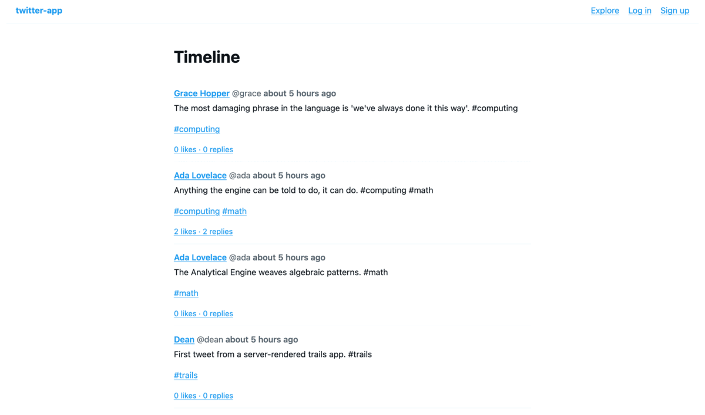
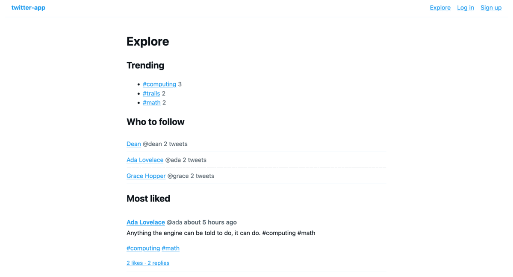
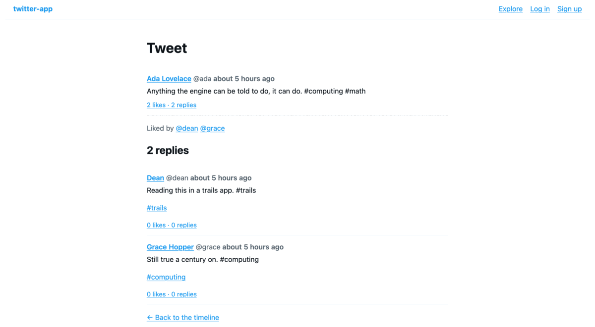
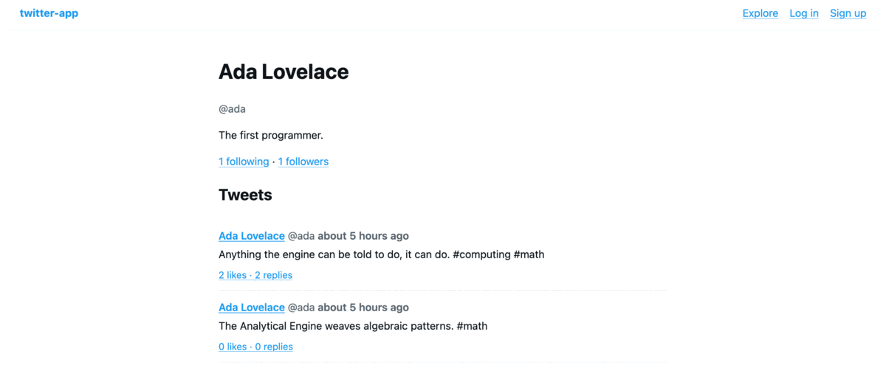

# Twitter app — the full trails stack

A server-rendered Twitter/X clone: routing → controllers → TSE views → HTML
over HTTP. No JSON API, no SPA, no client-side framework. Every page is
rendered on the server, the way a Rails app renders one.

This is the **first application in this repo to boot the whole stack**. Its
sibling [`../twitter-clone`](../twitter-clone) is ActiveRecord-only — Express
routes calling models directly — and is a better reference if the model layer
is all you need. This one exercises the half that had never run:
`ActionDispatch` routing, `ActionController::Base`, `ActionView`'s
`LookupContext`, and the `.tse` template language.

## What it looks like

Every page below is rendered on the server by a `.tse` template — no client
JavaScript is involved.

| Timeline                                                                                                   | Explore                                                                                                                |
| ---------------------------------------------------------------------------------------------------------- | ---------------------------------------------------------------------------------------------------------------------- |
|                                                                  |                                                                                |
| The home timeline: hashtag links, `likes_count` / `replies_count` counter caches, and `time_ago_in_words`. | Trending hashtags from a `joins` + `group` + `count` query across the HABTM join table, who-to-follow, and most-liked. |

| Conversation                                                                                   | Profile                                               |
| ---------------------------------------------------------------------------------------------- | ----------------------------------------------------- |
|                                                    |               |
| A thread: self-referential `replies`, and "Liked by" through the `likers` `has_many :through`. | Follower and following counts, and the user's tweets. |

## Run it

From the repo root, build the packages once (the example imports the compiled
`dist/`):

```sh
pnpm --filter @blazetrails/trailties... build
```

Then from this directory:

```sh
pnpm install          # if you haven't already at the workspace root
pnpm db:setup         # create the database, migrate, seed
pnpm start            # http://127.0.0.1:3000
```

Seeds create `@dean`, `@ada`, and `@grace`, all with the password
`password`.

```sh
pnpm smoke            # boots the app and drives every flow over real HTTP
pnpm typecheck        # schema-driven type-check via trails-tsc
```

`pnpm smoke` is the end-to-end test: it starts a real HTTP server on an
ephemeral port and drives sign-up, log-in, posting, following, liking, the
timeline, flash messages, the `requireLogin` filter, HTML escaping, and 404s
with a cookie-retaining `fetch` client, asserting on the rendered HTML. 36
checks.

## What it shows

- **Routing** — `src/config/routes.ts` with `root`, `resources`, and custom
  member routes (`/@:handle/following`). `trails routes` prints the table.
- **Controllers** — five of them, with `beforeAction` filters, strong
  parameters (`params.require("tweet").permit("body")`), `redirectTo`, and
  both explicit and implicit `render`.
- **Views** — TSE templates with a layout, a shared `_tweet` partial rendered
  from three different templates, and forms. `<%= %>` escapes; `<% %>` is
  control flow.
- **Models** — `User`, `Tweet`, `Follow`, `Like`. Zero-`declare` and
  zero-`attribute`: column types come from `db/schema.ts` via `trails-tsc`,
  and are reflected from the live database at runtime. Self-referential
  `hasMany … through:` powers follows.
- **Sessions, auth, and flash** — sign up, log in, log out, a `currentUser`
  helper, a `requireLogin` filter, and post-redirect flash messages.

## Generated, not hand-written

The app skeleton came out of the CLI, which is half the point of it existing:

```sh
node packages/trailties/bin/trails.js new twitter-app --database sqlite --skip-git
trails generate model User handle:string display_name:string bio:string password_digest:string
trails generate model Tweet user:references body:text
trails generate model Follow follower_id:integer followee_id:integer
trails generate model Like user_id:integer tweet_id:integer
trails generate authentication
```

Where a generator emitted something that didn't boot, the generator was
fixed rather than its output patched. Those fixes are in the same pull
request as this app.

## What is a workaround, and why

The framework gaps this app hit are tracked as
**RFC 0104 — twitter-app-full-stack-integration** in the tasks repo, one
story each. Every workaround below carries a `TODO(<story>)` comment naming
its story, so `grep -rn "TODO(0104" src/ db/` is the complete list.

| Workaround                                                                             | Story                                                                                                                             |
| -------------------------------------------------------------------------------------- | --------------------------------------------------------------------------------------------------------------------------------- |
| `ApplicationController` signs its own session cookie and carries the flash inside it   | `session-and-flash-lifecycle` — the session stores have no runnable `call(env)`, so `request.session` is never populated          |
| `layoutLocals()` passes `currentUser` and the flash to every template by hand          | `helper-methods-not-in-tse-scope` — `helper_method` and `ActionView`'s helpers are invisible to a `.tse` template                 |
| `src/server.ts` hand-rolls the `node:http` → `RackEnv` bridge                          | `no-rack-node-http-handler` — the only copy of that bridge is private to the Vite plugin                                          |
| `digestPassword` hashes with salted SHA-256                                            | `has-secure-password-unported` — no `has_secure_password`, no bcrypt                                                              |
| `config/application.ts` is a `boot()` function, not a `Trailties.Application` subclass | `boot-app-through-trailties-application` — `trails server` doesn't boot the ported `Application`, and it never splices `Finisher` |
| `connect()` primes the crypto adapter                                                  | `esm-adapters-need-explicit-priming` — activesupport's adapters only self-register under CommonJS                                 |
| `db/seed.ts` runs the seeds under `tsx`                                                | `cli-cannot-load-typescript-app-code` — the CLI has no TypeScript loader                                                          |
| `db:setup` uses `db test:prepare` for the test DB                                      | `db-migrate-loads-schema` — `trails db migrate` loads `db/schema.ts` first, so migrating a dumped app collides                    |

The single biggest one is the first framework story: **there are two classes
named `Application`**, and the Rails-faithful one
(`packages/trailties/src/application.ts`) is not the one that serves
requests. Until that converges, an app's `config/application.ts` cannot be
what Rails' is.

## Connection config

All connection settings live in `src/config/database.ts`, keyed by
environment, exactly like Rails' `config/database.yml`. `TRAILS_ENV`
(default `development`) picks the entry, and `Base.establishConnection()`
reads the file with no arguments. To use Postgres, change the `adapter`.
